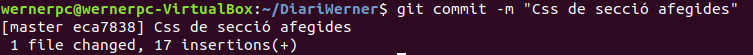
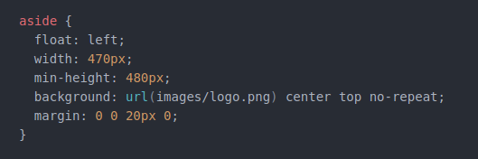
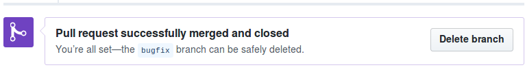
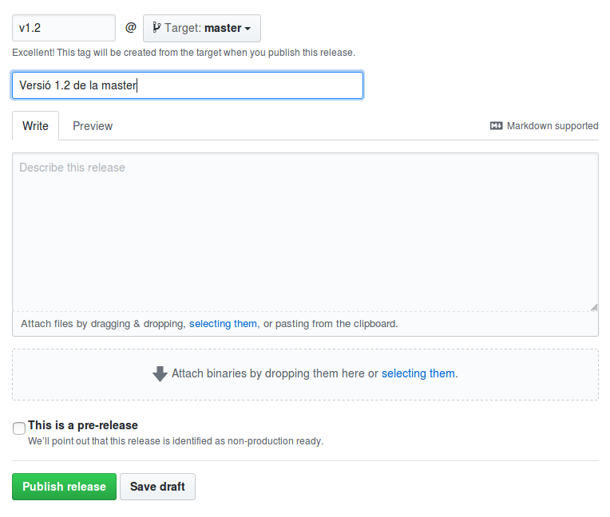
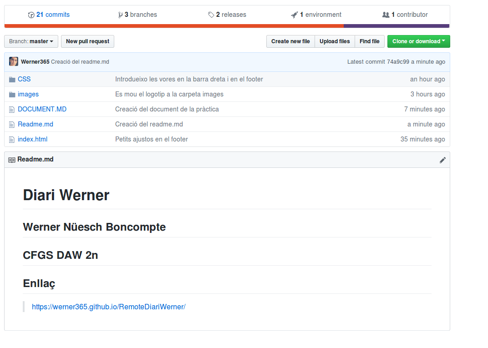
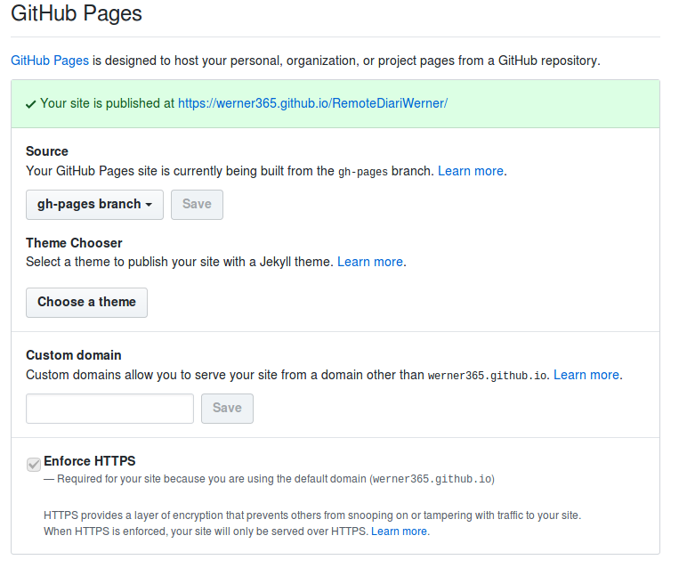
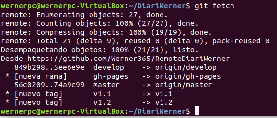
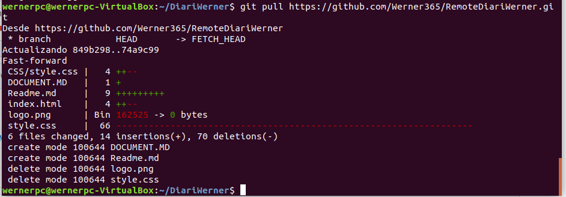

# PRACTICA WERNER #

**1. Creo un directori de treball anomenat /DiariVostreNom/ en el directori de l'usuari.**

**2. Inicialitzar el repositori buit.**

**3. Crear l'arxiu index.html**

**4. Afegir l'estructura bàsica**

**5. Crear un commit indicant que es crea l'esquelet bàsic del index.html**

**6. Afegir el contingut al head, entre <head> i </head>.**

**7. Crear un commit indicant que s'afegeix la capçalera del index.html**

**8. Afegir el contingut al body, entre <body> i </body>**

**9. Crear un commit indicant que s'afegeix l'estructura bàsica del body.**

**10. Crear un repositori en GitHub que s’anomeni RemoteDiariVostreNom (exemple RemoteDiariEduardo)**

**11. Assignar al vostre repostiorio global el remot**

**12. Afegir el contingut de section, entre section i section**

**13. Crear un commit indicant que s'afegeix tota l'estructura de la zona de posts.**

**14. Crear un arxiu style.css.**

**15. Afegir la següent informació**

**16. Crear un commit indicant que s'afegeixen les CSS d'html i de body**

**17. Afegir la següent informació**

**18. Crear un commit indicant que s'afegeixen les CSS de diversos elements HTML5: header,
section, article, aside i footer.**

**19. Afegir en el directori arrel de projecte el logotip que apareixerà en la barra lateral esquerra:
logo.png ( podeu ficar la imatge que vulgueu)**

**20. Crear un commit indicant que s'afegeix el logotip del Vostre Diari.**
**21. Afegir la següent informació.**

**22. Crear un commit indicant que s'afegeixen les CSS de section.**

**23. Afegir la següent informació.**

**24. Crear un commit indicant que s'afegeixen les CSS del footer**

**25. Afegir la següent informació**

**26. Crear un commit indicant que s'afegeixen les CSS de l'H1 i dels enllaços**
**27. Actualitzar la pàgina remota de forma regular fent amb l'ordre push.**

**28. Crear una etiqueta de v1.0**

**29. Crear una branca “develop”.**

**30. En aquesta branca de desenvolupament anem a realitzar diverses tasques:**

**31. Crear un directori de images i moure allí el logotip logo.png.**

**32. Crear un commit indicant que es mou el logotip a la carpeta images.**

**33. Crear un directori de CSS i moure allí les CSS style.css.**

**34. Crear un commit indicant que es mou la CSS a la carpeta CSS.**

**35. Canviar les referències a la CSS en el index.htm i al logotip logo.png en la CSS.**

**36. Crear un commit indicant que es canvien les referències a les CSS i a les imatges al reorganitzar-les
en directoris.**

**37. Actualitzar la pàgina remota de forma regular fent amb l'ordre push.**

**38. Anar al vostre repositori en Github.com i comprovar que ho teniu idèntic al vostre repositori
local.**

## A GITHUB.COM ##

**39. Crear una branca “bugfix” a partir de la “master” per resoldre una sèrie de modificacions.**

**40. Treure els comentaris en les CSS de les dues vores (comencen per //border ).**

**41. Crear un commit indicant que introdueixen les vores en la barra dreta i en el footer.**

**42. Introduir com a títol “Diari de Vostre Nom”.**

**43. Crear un commit indicant que s'introdueix el títol a la pàgina.**

**44. Canviar 2012 per 2018 en el footer. Treure (c).**

**45. Crear un commit indicant que es realitzen petits ajustos en el footer.**

**46. Crear una etiqueta de v1.1**

**47. Portar aquests canvis a la branca “master” ( realitzar un merge).**

**48. Esborrar la branca “bugfix”.**

**49. Portar els canvis de la branca “develop” a la branca “master”. Resoldre els conflictes, si hi
hagués.**
**50. Crear una etiqueta de v1.2**

**51. Afegir fitxer DOCUMENT.MD amb tota la pràctica, captura de pantalla, explicacions
etc…També en Markdown. ( en github). Podeu triar entre elaborar-lo en local i pujarho
a github ( ex: drag and drop) o treballar directament en l'editor de Github.**

**52. Activar la utilització de gh-pages i l'adreça de la pàgina web que es mostrés: recordar que
serà del tipus https://username.github.io/Diariremotoeduardo.**

**53. Afegir un document Readme.md escrit en Markdown, amb el vostre nom, curs i nom- practica
“Practica Diari Vostre Nom” i enllaç a la vostra pàgina generada anteriorment.**

**54. Lliurar l'adreça web del vostre master ( repositori). Heu de tenir tots els elements i la pagina
s'ha de visualitzar de forma correcta, en particular la carpeta CSS amb el css creat i la carpeta
imatges.**

## AL REPOSITORI LOCAL ##

**55. Actualitzar-ho amb els commits i canvis fets en el repositori remot ( fent possiblement git
fetch i git pull**

