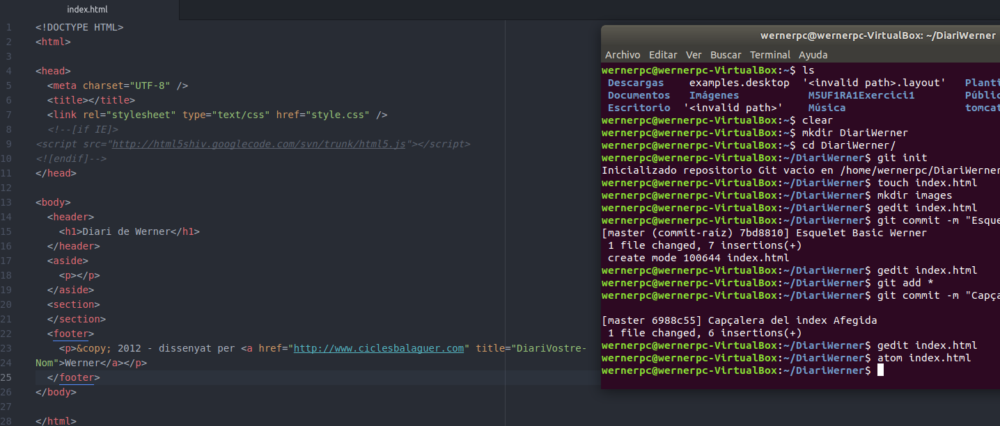

# PRACTICA WERNER #

**1. Creo un directori de treball anomenat /DiariVostreNom/ en el directori de l'usuari.**

**2. Inicialitzar el repositori buit.**

**3. Crear l'arxiu index.html**

**4. Afegir l'estructura bàsica**

**5. Crear un commit indicant que es crea l'esquelet bàsic del index.html**

**6. Afegir el contingut al head, entre <head> i </head>.**

**7. Crear un commit indicant que s'afegeix la capçalera del index.html**

**8. Afegir el contingut al body, entre <body> i </body>**

**9. Crear un commit indicant que s'afegeix l'estructura bàsica del body.**

**10. Crear un repositori en GitHub que s’anomeni RemoteDiariVostreNom (exemple RemoteDiariEduardo)**

